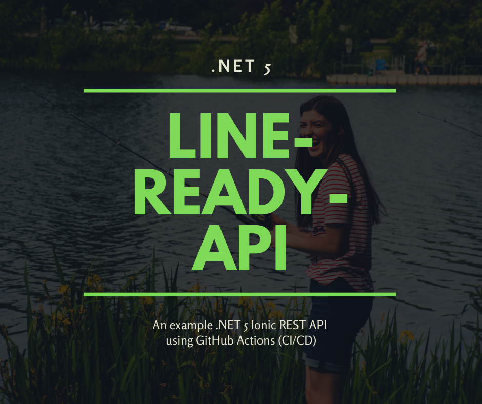

# line-ready-api


<br>

| Language | Framework              | Platform                       | Author        |
| -------- | ---------------------- | ------------------------------ | ------------- |
| C#       | .NET 5 | Fully managed compute platform on Windows. | Daniel Penrod |

<br>

> View on Azure: https://line-ready-api.azurewebsites.net


> About: An example .NET 5 Ionic REST API using GitHub Actions (CI/CD)


<br>
<br>



<br>

> View on Azure: https://line-ready-api.azurewebsites.net

<br>

## Running

 - #### Clone this repository  

```bash
    $ git clone https://github.com/galactic-plane/line-ready-api.git
```

- #### Install dependencies
```bash
    $ cd Application
    $ dotnet build
```

- #### Run Application
```bash
    $ cd Application/line-ready-api
    $ dotnet run

    You should see something like:

    info: Microsoft.Hosting.Lifetime[0]
      Now listening on: https://localhost:5001       
    info: Microsoft.Hosting.Lifetime[0]
      Now listening on: http://localhost:5000        
    info: Microsoft.Hosting.Lifetime[0]
      Application started. Press Ctrl+C to shut down.
```

## Deploying on Azure

Any change to this repository will result in triggering a workflow to build and deploy this app on azure as an app service. Learn more about [Azure App Service](https://docs.microsoft.com/en-us/azure/app-service/) and [Github Actions](https://docs.github.com/en/actions).

## Contributing

This project has adopted the [Microsoft Open Source Code of Conduct](https://opensource.microsoft.com/codeofconduct/). For more information see the [Code of Conduct FAQ](https://opensource.microsoft.com/codeofconduct/faq/) or contact [opencode@microsoft.com](mailto:opencode@microsoft.com) with any additional questions or comments.


## License:

See [LICENSE](LICENSE).

